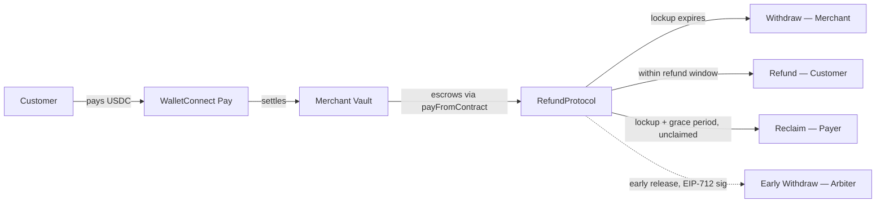

# Unwind

Non-custodial payment infrastructure for crypto commerce. Merchants accept stablecoin payments through a POS app, funds are held in an on-chain escrow contract with built-in refund and dispute resolution, and settlement happens trustlessly.

## How it works



1. Merchant creates a payment request from the POS app
2. Customer scans the QR code and pays in USDC via WalletConnect Pay
3. Payment lands in the merchant's vault, which routes it into the RefundProtocol escrow contract
4. Funds are locked for a configurable period — during which refunds can be issued
5. After the lockup expires, the merchant withdraws their funds

## Project structure

```
├── refund-protocol/       # Solidity smart contracts (Foundry)
│   ├── src/
│   │   ├── RefundProtocol.sol    # Core escrow contract
│   │   └── MerchantVault.sol     # Receives payments, bridges to escrow
│   ├── test/
│   ├── script/
│   └── foundry.toml
│
└── walletconnect-pay/     # POS application
    ├── pos-app/           # React Native (Expo) — iOS, Android, Web
    └── demo-server/       # Express.js dev server for local testing
```

## Refund Protocol

Deployed on **Base** (mainnet + Sepolia testnet). Written in Solidity ^0.8.24.

### Contracts

**RefundProtocol.sol** — The escrow contract. Handles payment creation, lockup enforcement, withdrawals, refunds, and reclaim.

Key flows:
- **`pay()`** / **`payAsRecipient()`** / **`payFromContract()`** — Different entry points for creating a payment depending on who initiates it
- **`withdraw()`** — Merchant claims funds after the lockup period
- **`earlyWithdrawByArbiter()`** — Arbiter can release funds early (requires EIP-712 signature from the merchant, fees apply)
- **`refundByRecipient()`** — Merchant-initiated refund within the refund window
- **`refundByArbiter()`** — Arbiter-forced refund (covers shortfall from arbiter balance, creates a debt on the merchant)
- **`reclaim()`** — Payer can reclaim funds if the merchant hasn't withdrawn after lockup + a 30-day grace period
- **`settleDebt()`** — Merchant repays debts from arbiter-covered refunds

Security: ReentrancyGuard, EIP-712 signature verification, per-payment refund windows, WalletConnect Pay ID deduplication.

**MerchantVault.sol** — Holds USDC received from payment rails. Calls `payFromContract()` on the RefundProtocol to escrow funds with the correct payer/merchant/amount metadata.

### Setup

```bash
cd refund-protocol

# Install dependencies (forge submodules)
forge install

# Run tests
forge test

# Deploy to Base Sepolia
forge script script/DeployRefundProtocol.s.sol \
  --rpc-url $BASE_SEPOLIA_RPC_URL \
  --broadcast

# Deploy MerchantVault
forge script script/DeployMerchantVault.s.sol \
  --rpc-url $BASE_SEPOLIA_RPC_URL \
  --broadcast
```

Required env vars:
```
PRIVATE_KEY=
ARBITER_ADDRESS=
USDC_ADDRESS=            # Base mainnet: 0x833589fCD6eDb6E08f4c7C32D4f71b54bdA02913
BASE_MAINNET_RPC_URL=
BASE_SEPOLIA_RPC_URL=
```

## WalletConnect Pay POS

A cross-platform point-of-sale app for merchants to accept crypto payments. Built with React Native (Expo 55).

### Features

- QR code payment flow via WalletConnect Pay merchant API
- Real-time payment status polling
- Transaction history with filtering and pagination
- Bluetooth thermal receipt printing
- Biometric authentication
- Light/dark theme with branded variants (Solflare, Phantom, Binance, etc.)
- Runs on iOS, Android, and Web

### Setup

```bash
cd walletconnect-pay/pos-app

# Install dependencies
pnpm install

# Copy env template
cp .env.example .env
# Fill in your WalletConnect Pay merchant credentials

# Run on iOS
pnpm ios

# Run on Android
pnpm android

# Run on web
pnpm web
```

Required env vars:
```
EXPO_PUBLIC_API_URL=              # WalletConnect Pay API base URL
EXPO_PUBLIC_GATEWAY_URL=          # Payment gateway URL
EXPO_PUBLIC_DEFAULT_MERCHANT_ID=  # Your merchant ID
EXPO_PUBLIC_DEFAULT_CUSTOMER_API_KEY=
EXPO_PUBLIC_MERCHANT_API_URL=     # Merchant Portal API
EXPO_PUBLIC_MERCHANT_PORTAL_API_KEY=
EXPO_PUBLIC_SENTRY_DSN=           # Optional, for error tracking
```

### Demo server

For local development without the full app:

```bash
cd walletconnect-pay/demo-server
npm install
cp .env.example .env
# Add your WCP_API_KEY and WCP_MERCHANT_ID
node server.mjs
# Runs on http://localhost:3847
```

## Stack

| Layer | Tech |
|-------|------|
| Smart contracts | Solidity, Foundry, OpenZeppelin |
| Chain | Base (USDC) |
| POS app | React Native, Expo 55, TypeScript |
| State | Zustand, TanStack Query |
| Payments | WalletConnect Pay merchant API |
| Monorepo | pnpm workspaces |
